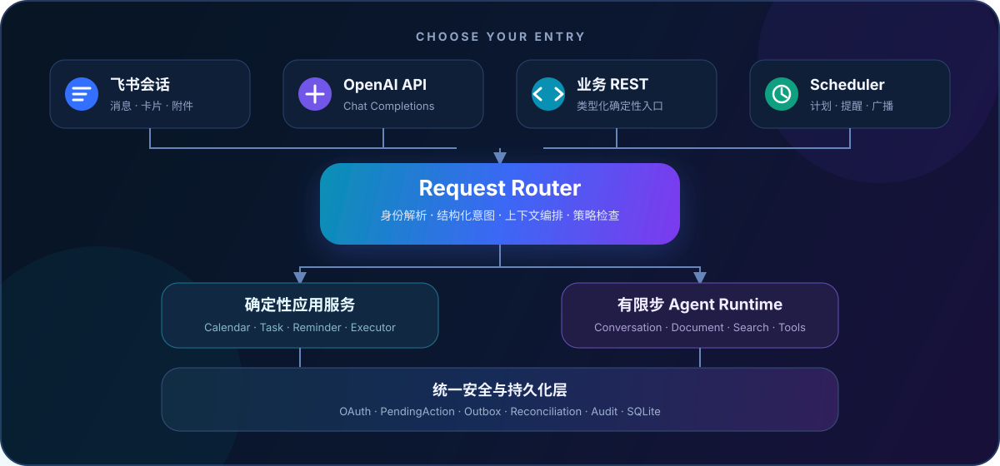

<div align="center">
  <picture>
    <source media="(prefers-color-scheme: dark)" srcset="assets/readme/song-agent-light.svg">
    <source media="(prefers-color-scheme: light)" srcset="assets/readme/song-agent-dark.svg">
    
  </picture>

  <p><strong>把自然语言、安全业务执行与飞书协作放进同一个多用户 Agent Runtime。</strong></p>

  <p>
    
    
    
    
  </p>
</div>

Song Agent 是一个基于 Python 与 FastAPI 的多用户飞书智能助手。它只让 LLM 负责理解意图和开放式分析；日历、任务、提醒等确定性业务统一进入应用服务、`PendingAction`、Outbox 与 Executor，授权、确认和最终执行始终由服务端控制。

## 选择你的入口

<div align="center">
  <a href="#统一运行时--一次理解两条执行路径">
    
  </a>

  <p>
    <strong>在飞书里直接使用？</strong> <a href="#飞书助手--在会话里完成工作">飞书助手</a> ·
    <strong>接入现有 AI 客户端？</strong> <a href="#openai-compatible-api--接入现有客户端">OpenAI-compatible API</a> ·
    <strong>构建确定性工作流？</strong> <a href="#业务-rest-api--先准备再确认">业务 REST API</a> ·
    <strong>了解安全边界？</strong> <a href="#统一运行时--一次理解两条执行路径">统一运行时</a>
  </p>
</div>

---

## 飞书助手 — 在会话里完成工作

通过飞书 WebSocket 长连接接收私聊与群聊消息，在同一个会话中管理日历、任务、提醒、文档和每日计划。机器人进入新群后，首次收到 `@机器人` 消息会自动登记该群；若应用获批 `im:message.group_msg`，还可接收群内未 `@` 的普通消息。

```text
@宋管家 帮我整理今天的计划
@宋管家 十分钟后提醒我开会
@宋管家 创建一份项目进展文档
@宋管家 把这段内容追加到项目方案
@宋管家 复盘今天的任务
```

图片、语音和文件可在飞书入口按配置进入视觉理解、ASR 与文档解析链路。日历、任务等外部写操作会先展示确认卡片，只有原发起者确认后，Executor 才会调用飞书 OpenAPI。

### 快速开始

```bash
git clone https://github.com/YiHarvest/song-agent-feishu.git
cd song-agent-feishu
uv sync
cp .env.example .env
```

生成独立的 Token 加密主密钥，并把结果写入 `.env` 的 `SONG_AGENT_TOKEN_KEY_V1`：

```bash
uv run python -c "import base64,secrets; print(base64.urlsafe_b64encode(secrets.token_bytes(32)).decode())"
```

随后至少配置 `FEISHU_APP_ID`、`FEISHU_APP_SECRET`、`LLM_BASE_URL`、`LLM_API_KEY` 与 `LLM_MODEL`，再启动服务：

```bash
uv run song-agent --reload
```

在飞书开放平台使用长连接订阅 `im.message.receive_v1`，并将卡片回调地址设置为：

```text
https://你的域名/feishu/card/action
```

用户 OAuth 回调固定为 `https://你的域名/oauth/callback`。开发环境可用 `ngrok http 45837` 暴露本地服务，并将公网地址写入 `PUBLIC_BASE_URL`。

飞书应用至少需要以下能力：

- 应用身份：`im:message:send_as_bot`、`im:message.p2p_msg:readonly`；如需接收群内未 `@` 消息，再申请 `im:message.group_msg`。
- 用户身份：日历读写、任务读写、文档与云盘、文档搜索、消息读取及 `offline_access`。
- 事件与回调：`im.message.receive_v1`、`card.action.trigger`。

申请 `im:message.group_msg` 后需要发布新版本并等待企业管理员审批；平台未投递的消息无法由服务端补回。

**飞书内置命令：** `/help` · `/status` · `/clear`

---

## OpenAI-compatible API — 接入现有客户端

Song Agent 提供文本型 Chat Completions 接口，可接入使用 OpenAI 协议的 SDK、CLI 或内部服务。请求仍会经过同一个身份解析、Request Router、权限策略与审计链路。

先在 `.env` 中启用并配置 API：

```dotenv
SONG_AGENT_API_ENABLED=true
SONG_AGENT_API_MODEL_ID=song-agent-2.1
SONG_AGENT_API_KEY=replace-with-a-strong-secret
```

然后发送请求：

```bash
curl http://127.0.0.1:45837/api/v1/chat/completions \
  -H "Authorization: Bearer $SONG_AGENT_API_KEY" \
  -H "Content-Type: application/json" \
  -d '{
    "model": "song-agent-2.1",
    "messages": [
      {"role": "user", "content": "帮我整理今天的工作安排"}
    ]
  }'
```

接口支持普通响应与 SSE streaming，并接受 `Idempotency-Key` 保护可重放请求。外部 API 当前仅支持文本；需要图片、语音或文件理解时请使用飞书入口。

**核心接口：** `GET /api/v1/models` · `POST /api/v1/chat/completions` · `GET /health`

---

## 业务 REST API — 先准备，再确认

确定性业务接口不会让请求直接穿透到飞书。写操作先生成待确认动作，后续确认、取消或重试都只引用服务端保存的 `action_id`。

| 资源 | 查询 | 准备写操作 |
| --- | --- | --- |
| 日历 | `GET /api/calendar/events` | `POST/PATCH/DELETE /api/calendar/events/.../prepare` |
| 任务 | `GET /api/tasks` | `POST/PATCH/DELETE /api/tasks/.../prepare` |
| 提醒 | `GET /api/reminders` | `POST/DELETE /api/reminders/.../prepare` |
| 待确认动作 | `GET /api/pending-actions/{action_id}` | `confirm` · `cancel` · `retry` |

写操作的完整参数、发起者、Payload Hash 和执行状态都保存在 SQLite；交互卡片只携带动作名与 `action_id`。

---

## 统一运行时 — 一次理解，两条执行路径

自然语言首先进入结构化意图提取。日历、任务和提醒等已知业务走确定性应用服务；普通对话、文档协作和开放式分析进入有步数与工具预算的 Agent Runtime。两条路径共享同一套身份、上下文、OAuth、审计与持久化设施。

```text
Feishu / OpenAI API / REST / Scheduler
                  │
            Request Router
             ┌────┴────┐
             │         │
    Application      Bounded Agent
      Services         Runtime
             │         │
             └────┬────┘
                  │
 OAuth · PendingAction · Outbox · Audit · SQLite
```

安全边界包括：

- 身份和会话按 tenant、app、chat、thread 与 principal 隔离。
- OAuth access/refresh token 使用 AES-256-GCM 加密后存入权限为 `0600` 的 SQLite 数据库。
- LLM 不能决定授权、确认、执行器或交互卡片结构。
- 确认与 Outbox 同事务写入；Executor 原子 claim 后才执行远端调用。
- 远端结果不确定时动作进入 `UNKNOWN`，不会盲目重试。
- Scheduler 使用持久化 job、leader lease 与 fencing token；网络调用期间不占用业务事务。
- Audit log 与 Agent step 只记录必要摘要、参数形状和 Hash，不保存 Token 或隐藏思维链。

当前 Web、飞书 Gateway 与 Scheduler 装配在同一进程。Scheduler 支持多实例选主；飞书长连接 Gateway 应保持单实例，多 Web worker 部署前需将 Gateway 拆为独立进程。

---

## 能力矩阵

| 能力 | 飞书会话 | OpenAI-compatible API | 业务 REST API |
| --- | :---: | :---: | :---: |
| 普通对话与开放式分析 | ✅ | ✅ | — |
| 日历、任务与提醒 | ✅ | 需绑定飞书身份 | ✅ |
| 文档创建、检索与追加 | ✅ | 需绑定飞书身份 | — |
| 图片、语音与文件理解 | ✅ | — | — |
| 流式文本响应 | — | ✅ | — |
| PendingAction 确认链路 | ✅ | ✅ | ✅ |

## 核心组件

| 组件 | 职责 |
| --- | --- |
| `song_agent.application` | Request Router、日历/任务/提醒应用服务与 OpenAI 适配器 |
| `song_agent.agent` | 有限步数、有限工具预算的开放式 Agent Runtime |
| `song_agent.executors` | 已确认业务动作的确定性执行器 |
| `song_agent.feishu` | WebSocket Transport、OAuth、卡片、OpenAPI 与 MCP 适配 |
| `song_agent.services` | PendingAction、Outbox、reconciliation、审计与 API 身份绑定 |
| `song_agent.scheduler` | 持久化定时任务、lease 与 fencing |
| `song_agent.attachments` | 可信下载、暂存、生命周期与附件工具 |

## 验证

```bash
uv run ruff check song_agent tests
uv run pytest -q
curl http://127.0.0.1:45837/health
```

数据默认保存在 `.data/song-agent.db`。旧 `.data/state.json` 只会在首次迁移时读取，迁移后不再写入。

密钥轮换时保留旧版本密钥，新增下一版本并更新 `SONG_AGENT_TOKEN_ACTIVE_KEY_VERSION`，随后执行：

```bash
uv run song-agent-rotate-keys
```

## 资源

- [环境变量模板](.env.example) — 飞书、LLM、API、附件与 Scheduler 的完整配置项
- [项目依赖与命令](pyproject.toml) — Python 版本、运行入口与开发依赖
- [GitHub Issues](https://github.com/YiHarvest/song-agent-feishu/issues) — 缺陷报告与功能讨论
- `http://127.0.0.1:45837/docs` — 服务启动后可用的交互式 API 文档

## 贡献

请从 `dev` 创建语义清晰的短分支，例如 `feat/calendar-sync`、`fix/oauth-refresh` 或 `docs/readme-brand-refresh`。每个 PR 只处理一个议题，并在提交前运行 Ruff 与测试套件。
