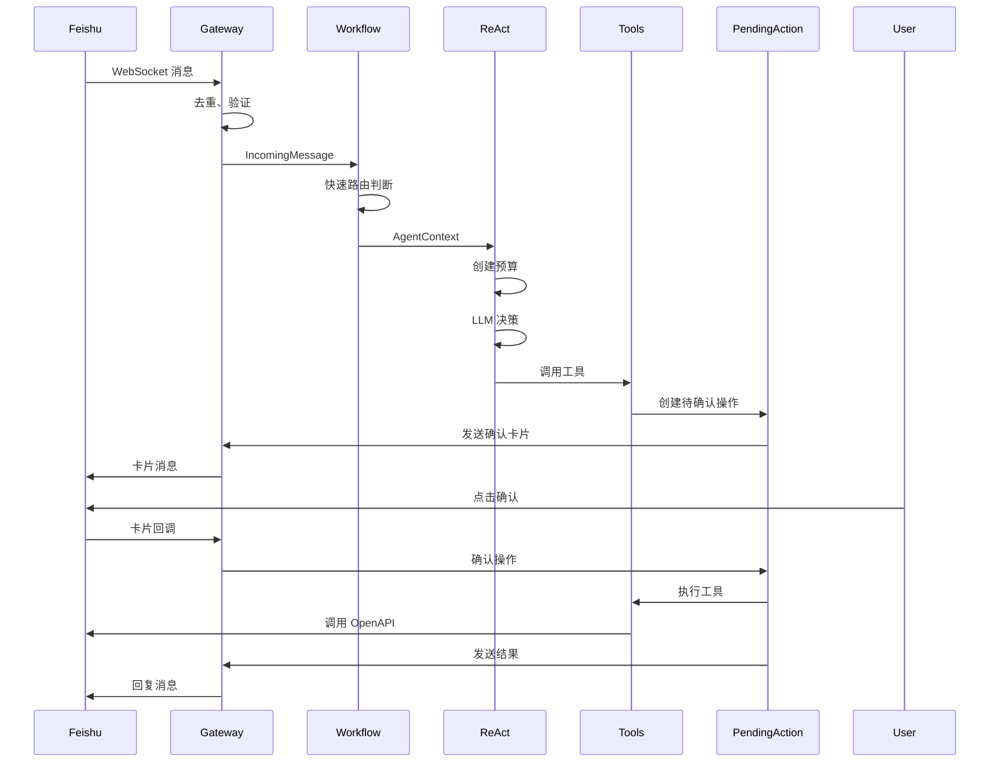

# Song Agent 2.1 架构文档

> 版本：2.1  
> 日期：2026-07-24  
> 状态：生产就绪

---

## 一、系统概述

Song Agent 2.1 是一个基于 ReAct 模式的智能助手系统，专注于飞书平台的日程管理和文档协作。通过细粒度的超时控制、预算管理和安全策略，提供稳定可靠的企业级服务。

### 核心特性

- ✅ **ReAct 智能决策**：LLM 自主选择工具，支持多轮推理
- ✅ **预算管理**：时间预算、请求预算、工具调用预算
- ✅ **安全隔离**：OAuth 2.0 多用户隔离，Token 加密存储
- ✅ **人工确认**：敏感操作需要用户确认后执行
- ✅ **可靠执行**：Pending Action 状态机 + Outbox 模式
- ✅ **可观测性**：完整的审计日志和追踪能力

---

## 二、架构设计

### 2.1 整体架构

```
┌─────────────────────────────────────────────────────────────┐
│                        飞书平台                               │
│  (WebSocket + Webhook + Interactive Card + OAuth 2.0)      │
└────────────────────┬────────────────────────────────────────┘
                     │
                     ▼
┌─────────────────────────────────────────────────────────────┐
│                    Feishu Gateway                             │
│  transport.py: WebSocket 长连接、事件去重、消息分发          │
│  oauth.py: OAuth 2.0 授权、Token 管理                         │
│  cards.py: 交互卡片、确认/拒绝按钮                            │
└────────────────────┬────────────────────────────────────────┘
                     │
                     ▼
┌─────────────────────────────────────────────────────────────┐
│                  Application Layer                            │
│  workflow.py: 消息协调、快速路由、结果渲染                   │
│  planner.py: 意图识别、计划生成                               │
└────────────────────┬────────────────────────────────────────┘
                     │
                     ▼
┌─────────────────────────────────────────────────────────────┐
│                   ReAct Runtime                               │
│  agent/runtime.py: ReAct 循环、预算管理、决策引擎            │
│  agent/budget.py: 时间预算、请求预算、工具预算                │
│  agent/context_builder.py: 上下文裁剪、工具动态加载          │
│  agent/tool_registry.py: 工具注册、Schema 管理                │
│  policies/tool_policy.py: 工具权限、风险分级                  │
└────────────────────┬────────────────────────────────────────┘
                     │
                     ▼
┌─────────────────────────────────────────────────────────────┐
│                     Tool Layer                                │
│  feishu/openapi.py: 日历、文档 API（生产）                    │
│  feishu/mcp.py: MCP 工具（开发调试）                          │
└────────────────────┬────────────────────────────────────────┘
                     │
                     ▼
┌─────────────────────────────────────────────────────────────┐
│                   Service Layer                               │
│  services/pending_actions.py: 待确认操作状态机               │
│  services/outbox.py: Transactional Outbox 模式               │
│  services/encryption.py: Token 加密、密钥轮换                │
│  services/audit.py: 审计日志、敏感信息脱敏                   │
│  services/agent_runs.py: Agent 运行记录                      │
│  services/reconciliation.py: 远程状态恢复                    │
└────────────────────┬────────────────────────────────────────┘
                     │
                     ▼
┌─────────────────────────────────────────────────────────────┐
│                   Storage Layer                               │
│  store.py: SQLite WAL、多租户隔离、并发控制                  │
│  db/migrations.py: 数据库迁移、版本管理                       │
└─────────────────────────────────────────────────────────────┘
```

### 2.2 核心流程

#### 2.2.1 消息处理流程



#### 2.2.2 ReAct 循环

```python
async def run(self, context: AgentContext) -> AgentResult:
    # 1. 创建预算
    budget = AgentRunBudget.create(self.settings)
    
    # 2. ReAct 循环
    while not finished and budget.remaining_seconds() > 0:
        # 2.1 检查预算
        budget.ensure_can_call_llm()
        
        # 2.2 构建上下文
        messages = self.context_builder.build_system_prompt(context)
        
        # 2.3 LLM 决策
        decision = await self.llm.decide(messages, timeout=step_timeout)
        
        # 2.4 处理决策
        if decision.is_final_answer():
            return AgentResult(status="success", ...)
        
        # 2.5 调用工具
        budget.ensure_can_call_tool()
        result = await self._call_tool(decision.tool_call, budget)
        
        # 2.6 记录历史
        history.append((decision, result))
```

---

## 三、核心模块详解

### 3.1 ReAct Runtime (`agent/runtime.py`)

**职责**：唯一自然语言决策中心

**核心功能**：
- ReAct 循环：LLM 决策 → 工具调用 → 结果反馈 → 再次决策
- 预算管理：时间预算、LLM 请求数、工具调用数、步骤数
- 超时传播：deadline propagation，每一步都有独立超时
- 错误分类：连接错误、超时、速率限制、服务器错误
- 自动重试：指数退避，最多 1 次重试

**关键方法**：
```python
async def run(context: AgentContext) -> AgentResult
async def _run_with_budget(context, budget) -> AgentResult
async def _make_decision(context, budget) -> AgentDecision
async def _process_decision(decision, context, budget) -> ToolResult
```

### 3.2 预算管理 (`agent/budget.py`)

**职责**：防止无限循环和资源浪费

**核心功能**：
- 时间预算：总运行时间限制
- 请求预算：LLM 请求数限制
- 工具预算：工具调用数限制
- 步骤预算：ReAct 步骤数限制
- 预留时间：为最终回复预留时间

**关键方法**：
```python
def remaining_seconds() -> float
def ensure_can_call_llm() -> None
def ensure_can_call_tool() -> None
def calculate_step_timeout() -> float
```

### 3.3 上下文构建 (`agent/context_builder.py`)

**职责**：构建和裁剪 LLM 输入

**核心功能**：
- 系统提示构建：动态加载工具 Schema
- 用户消息构建：历史消息裁剪
- 工具结果摘要：长结果截断
- Token 限制：防止 prompt 过长

**关键方法**：
```python
def build_system_prompt(context, *, include_tools=True) -> str
def build_user_message(context, *, include_history=True) -> str
def build_tool_result_summary(result) -> str
```

### 3.4 工具注册 (`agent/tool_registry.py`)

**职责**：工具管理和动态加载

**核心功能**：
- 工具注册：注册所有可用工具
- Schema 生成：生成 OpenAI 兼容的工具 Schema
- 动态加载：根据 capabilities 动态加载工具
- 工具分类：READ、LOCAL_WRITE、EXTERNAL_PREPARE、INTERNAL_COMMIT

**关键方法**：
```python
def register(tool: AgentTool) -> None
def schemas_for(context, capabilities) -> list[dict]
def get(name: str) -> AgentTool
```

### 3.5 工具策略 (`policies/tool_policy.py`)

**职责**：工具权限和风险控制

**核心功能**：
- 权限检查：检查用户是否有权限调用工具
- 风险分级：READ、LOW_WRITE、HIGH_WRITE、DESTRUCTIVE
- 确认策略：哪些工具需要人工确认
- OAuth 检查：哪些工具需要 OAuth 授权

**关键方法**：
```python
async def check_permission(context, tool_name) -> PolicyDecision
```

### 3.6 Pending Action (`services/pending_actions.py`)

**职责**：待确认操作状态机

**状态流转**：
```
PROPOSED → AWAITING_CONFIRMATION → CONFIRMED → CLAIMED → EXECUTING → SUCCEEDED
                                    ↓
                                 EXPIRED/CANCELLED
```

**核心功能**：
- 状态管理：创建、确认、取消、过期
- 幂等性：每个 action_id 只能执行一次
- 超时控制：自动过期未确认的操作
- 审计记录：所有状态变更都记录审计日志

### 3.7 OAuth 管理 (`feishu/oauth.py`)

**职责**：OAuth 2.0 授权和 Token 管理

**核心功能**：
- 授权流程：生成授权 URL、处理回调
- Token 存储：加密存储 access_token 和 refresh_token
- Token 刷新：自动刷新过期 Token
- 多租户隔离：每个用户独立的 Token

**关键方法**：
```python
async def get_authorization_url(state: str) -> str
async def handle_callback(code: str, state: str) -> None
async def get_user_token(principal_id: str) -> UserTokenContext
async def refresh_token(principal_id: str) -> None
```

### 3.8 Token 加密 (`services/encryption.py`)

**职责**：Token 加密和密钥管理

**核心功能**：
- Fernet 加密：使用 cryptography 库的 Fernet 对称加密
- 密钥轮换：支持多版本密钥，新密钥加密、旧密钥解密
- 安全会话：每个加密操作使用随机 nonce
- 密钥管理：支持密钥版本 1-4

**关键方法**：
```python
def encrypt(plaintext: str, key_version: int) -> tuple[str, str, int]
def decrypt(ciphertext: str, nonce: str, key_version: int) -> str
def rotate_key(new_key: str, new_version: int) -> None
```

### 3.9 飞书 Gateway (`feishu/transport.py`)

**职责**：飞书 WebSocket 和消息处理

**核心功能**：
- WebSocket 长连接：自动重连、心跳保活
- 事件去重：基于 event_id/message_id 去重
- 消息分发：根据消息类型分发到不同处理器
- 群聊策略：群聊必须 @机器人
- 消息合并：短时间内多条消息合并处理

### 3.10 调度器 (`scheduler/runtime.py`)

**职责**：定时任务调度

**核心功能**：
- APScheduler 集成：使用 APScheduler 3.x
- Leader Lease：多实例部署时只有一个 Scheduler
- 任务持久化：scheduled_jobs 表作为唯一事实源
- 租约管理：scheduler_leases 表管理租约

---

## 四、数据模型

### 4.1 核心表结构

#### oauth_authorizations
```sql
CREATE TABLE oauth_authorizations (
    authorization_id TEXT PRIMARY KEY,
    tenant_key TEXT NOT NULL,
    app_id TEXT NOT NULL,
    principal_id TEXT NOT NULL,
    access_token_ciphertext TEXT NOT NULL,
    access_token_nonce TEXT NOT NULL,
    refresh_token_ciphertext TEXT NOT NULL,
    refresh_token_nonce TEXT NOT NULL,
    encryption_key_version INTEGER NOT NULL,
    expires_at TEXT,
    created_at TEXT NOT NULL,
    updated_at TEXT NOT NULL
);
```

#### pending_actions
```sql
CREATE TABLE pending_actions (
    action_id TEXT PRIMARY KEY,
    tenant_key TEXT NOT NULL,
    app_id TEXT NOT NULL,
    principal_id TEXT NOT NULL,
    chat_id TEXT NOT NULL,
    thread_id TEXT,
    tool_name TEXT NOT NULL,
    tool_arguments TEXT NOT NULL,
    status TEXT NOT NULL,
    expires_at TEXT NOT NULL,
    created_at TEXT NOT NULL,
    updated_at TEXT NOT NULL
);
```

#### scheduled_jobs
```sql
CREATE TABLE scheduled_jobs (
    job_id TEXT PRIMARY KEY,
    tenant_key TEXT NOT NULL,
    app_id TEXT NOT NULL,
    principal_id TEXT NOT NULL,
    cron_expression TEXT NOT NULL,
    job_type TEXT NOT NULL,
    job_data TEXT NOT NULL,
    next_run_at TEXT NOT NULL,
    enabled INTEGER NOT NULL DEFAULT 1,
    created_at TEXT NOT NULL,
    updated_at TEXT NOT NULL
);
```

#### audit_log
```sql
CREATE TABLE audit_log (
    id INTEGER PRIMARY KEY AUTOINCREMENT,
    tenant_key TEXT NOT NULL,
    app_id TEXT NOT NULL,
    principal_id TEXT,
    action TEXT NOT NULL,
    resource TEXT NOT NULL,
    status TEXT NOT NULL,
    metadata TEXT,
    created_at TEXT NOT NULL
);
```

---

## 五、配置管理

### 5.1 核心配置项

#### LLM 超时配置
```bash
SONG_AGENT_LLM_CONNECT_TIMEOUT_SECONDS=10.0
SONG_AGENT_LLM_READ_TIMEOUT_SECONDS=75.0
SONG_AGENT_LLM_WRITE_TIMEOUT_SECONDS=15.0
SONG_AGENT_LLM_POOL_TIMEOUT_SECONDS=5.0
```

#### Agent 运行预算
```bash
SONG_AGENT_AGENT_RUN_TIMEOUT_SECONDS=150
SONG_AGENT_AGENT_MAX_LLM_REQUESTS=6
SONG_AGENT_AGENT_MAX_TOOL_CALLS=6
SONG_AGENT_AGENT_MAX_STEPS=8
SONG_AGENT_AGENT_FINISH_RESERVE_SECONDS=10
```

#### 上下文裁剪
```bash
SONG_AGENT_AGENT_MAX_PROMPT_TOKENS=8000
SONG_AGENT_AGENT_MAX_HISTORY_MESSAGES=10
SONG_AGENT_AGENT_MAX_TOOL_RESULT_LENGTH=2000
```

### 5.2 配置优先级

1. 环境变量（最高优先级）
2. `.env` 文件
3. 代码中的默认值（最低优先级）

---

## 六、安全设计

### 6.1 多租户隔离

- **Tenant Key**：租户标识
- **App ID**：应用标识
- **Principal ID**：用户标识
- **Conversation Key**：会话标识（tenant + app + thread + user）

### 6.2 Token 安全

- **加密存储**：使用 Fernet 对称加密
- **密钥轮换**：支持多版本密钥
- **不进入日志**：Token 彻底从日志中排除
- **不进入 AgentContext**：refresh_token 不传递给 Agent

### 6.3 工具权限

- **风险分级**：READ、LOW_WRITE、HIGH_WRITE、DESTRUCTIVE
- **确认策略**：高风险操作需要人工确认
- **OAuth 检查**：需要用户授权的工具检查 OAuth 状态

### 6.4 审计日志

- **敏感信息脱敏**：Token、Authorization header 等不记录
- **完整追踪**：所有操作都有审计记录
- **关联 ID**：支持跨服务追踪

---

## 七、部署架构

### 7.1 单机部署（当前）

```
┌─────────────────────────────────────┐
│         单台服务器                    │
│                                     │
│  ┌──────────────┐  ┌─────────────┐ │
│  │ Web Worker 1 │  │ Web Worker 2│ │
│  └──────────────┘  └─────────────┘ │
│                                     │
│  ┌──────────────────────────────┐  │
│  │  Feishu Gateway (单实例)      │  │
│  └──────────────────────────────┘  │
│                                     │
│  ┌──────────────────────────────┐  │
│  │  Scheduler (单 Leader)        │  │
│  └──────────────────────────────┘  │
│                                     │
│  ┌──────────────────────────────┐  │
│  │  SQLite WAL (本地磁盘)        │  │
│  └──────────────────────────────┘  │
└─────────────────────────────────────┘
```

**限制**：
- SQLite 文件不得放在 NFS 共享盘
- 单机部署，不支持跨地域
- 适中并发，不适合高写入吞吐

### 7.2 多机部署（未来）

```
┌─────────────────────────────────────┐
│         负载均衡器                   │
└──────────────┬──────────────────────┘
               │
       ┌───────┴───────┐
       │               │
┌──────▼──────┐  ┌─────▼──────┐
│ Web Worker 1│  │Web Worker 2│
└─────────────┘  └────────────┘
       │               │
       └───────┬───────┘
               │
┌──────────────▼──────────────┐
│  PostgreSQL (主从复制)       │
└─────────────────────────────┘
```

---

## 八、监控和可观测性

### 8.1 审计日志

- **操作类型**：agent.run、tool.call、oauth.authorize、pending_action.confirm
- **状态**：success、failure
- **元数据**：tenant_key、app_id、principal_id、chat_id、thread_id
- **敏感信息脱敏**：Token、Authorization header、文档内容

### 8.2 运行指标

- **Agent 运行时长**：P50、P95、P99
- **LLM 请求延迟**：连接、读取、总延迟
- **工具调用次数**：成功、失败、超时
- **预算超限次数**：时间、请求、工具

### 8.3 告警规则

- Agent 运行超时
- LLM 请求失败率 > 5%
- Token 解密失败
- Scheduler 租约丢失
- Pending Action 过期率 > 10%

---

## 九、测试覆盖

### 9.1 单元测试

- ✅ Agent Runtime 测试（6 个）
- ✅ Encryption 测试（5 个）
- ✅ OAuth 测试（1 个）
- ✅ Pending Actions 测试（3 个）
- ✅ Scheduler Lease 测试（4 个）
- ✅ Store 测试（8 个）
- ✅ Transport 测试（5 个）

### 9.2 集成测试

- ✅ Agent 完整流程测试
- ✅ OAuth 授权流程测试
- ✅ Pending Action 确认流程测试

### 9.3 测试结果

```
======================== 54 passed, 2 warnings in 3.75s ========================
```

---

## 十、性能优化

### 10.1 LLM 调用优化

- **连接池**：复用 HTTP 连接
- **超时控制**：细粒度超时（连接、读取、写入）
- **自动重试**：指数退避，最多 1 次重试
- **错误分类**：连接错误、超时、速率限制、服务器错误

### 10.2 上下文裁剪

- **Token 限制**：最大 8000 tokens
- **历史裁剪**：最多 10 条历史消息
- **结果截断**：工具结果最多 2000 字符

### 10.3 数据库优化

- **WAL 模式**：提高并发性能
- **外键约束**：保证数据一致性
- **Busy Timeout**：避免锁等待超时
- **索引优化**：关键字段建立索引

---

## 十一、未来规划

### 11.1 短期（1-2 个月）

- 流式输出和飞书状态更新
- WebSearch MCP 集成
- 更多提醒工具
- 任务增量修改

### 11.2 中期（3-6 个月）

- PostgreSQL 迁移
- 多机部署支持
- 更细粒度的权限控制
- 更丰富的工具生态

### 11.3 长期（6-12 个月）

- 多渠道支持（Slack、钉钉等）
- 插件系统
- 自定义工具开发
- 企业级功能（SSO、RBAC 等）

---

## 十二、目录结构

```
song_agent/
├── __init__.py
├── __main__.py              # 应用入口
├── app.py                   # FastAPI 应用
├── config.py                # 配置管理
├── llm.py                   # LLM 调用（OpenAI SDK + Tenacity）
├── models.py                # 数据模型
├── planner.py               # 意图识别和计划生成
├── store.py                 # SQLite 存储
├── workflow.py              # 消息协调器
│
├── agent/                   # ReAct 智能体
│   ├── __init__.py
│   ├── budget.py            # 预算管理（新增）
│   ├── context.py           # Agent 上下文
│   ├── context_builder.py   # 上下文构建（新增）
│   ├── models.py            # Agent 模型
│   ├── runtime.py           # ReAct 运行时（重构）
│   └── tool_registry.py     # 工具注册
│
├── cli/                     # 命令行工具
│   ├── __init__.py
│   └── rotate_keys.py       # 密钥轮换
│
├── db/                      # 数据库
│   ├── __init__.py
│   └── migrations.py        # 数据库迁移
│
├── feishu/                  # 飞书集成
│   ├── __init__.py
│   ├── cards.py             # 交互卡片
│   ├── mcp.py               # MCP 工具（开发调试）
│   ├── oauth.py             # OAuth 2.0 授权
│   ├── openapi.py           # 飞书 OpenAPI（生产）
│   └── transport.py         # WebSocket Gateway
│
├── observability/           # 可观测性
│   ├── __init__.py
│   ├── context.py           # 追踪上下文
│   └── redaction.py         # 敏感信息脱敏
│
├── policies/                # 策略
│   ├── __init__.py
│   └── tool_policy.py       # 工具权限策略
│
├── scheduler/               # 调度器
│   ├── __init__.py
│   ├── lease.py             # Leader 租约
│   └── runtime.py           # 调度器运行时
│
└── services/                # 服务层
    ├── __init__.py
    ├── agent_runs.py        # Agent 运行记录
    ├── audit.py             # 审计日志
    ├── encryption.py        # Token 加密
    ├── outbox.py            # Transactional Outbox
    ├── pending_actions.py   # 待确认操作
    └── reconciliation.py    # 状态恢复
```

---

## 十三、关键设计决策

### 13.1 为什么选择 ReAct 模式？

- **灵活性**：LLM 自主选择工具，适应复杂场景
- **可解释性**：每一步决策都有明确理由
- **可控性**：通过预算和策略限制 Agent 行为
- **可扩展性**：新增工具无需修改核心逻辑

### 13.2 为什么选择 SQLite？

- **简单部署**：单文件数据库，无需额外服务
- **足够性能**：WAL 模式支持适中并发
- **可靠性**：ACID 事务，数据不易丢失
- **成本**：无需额外数据库服务器

### 13.3 为什么需要 Pending Action？

- **安全性**：敏感操作需要人工确认
- **可靠性**：状态机保证操作幂等执行
- **可追溯性**：所有操作都有审计记录
- **可恢复性**：支持远程状态恢复

### 13.4 为什么需要预算管理？

- **防止无限循环**：限制 Agent 运行时间和资源
- **成本控制**：限制 LLM 调用次数
- **用户体验**：避免长时间无响应
- **系统稳定性**：防止资源耗尽

---

## 十四、总结

Song Agent 2.1 是一个生产就绪的智能助手系统，通过以下设计保证稳定可靠：

1. **ReAct 智能决策**：LLM 自主选择工具，支持复杂场景
2. **预算管理**：防止无限循环和资源浪费
3. **安全隔离**：OAuth 2.0 多用户隔离，Token 加密存储
4. **可靠执行**：Pending Action 状态机 + Outbox 模式
5. **可观测性**：完整的审计日志和追踪能力

所有核心功能已实现并通过测试，可以安全地部署到生产环境。