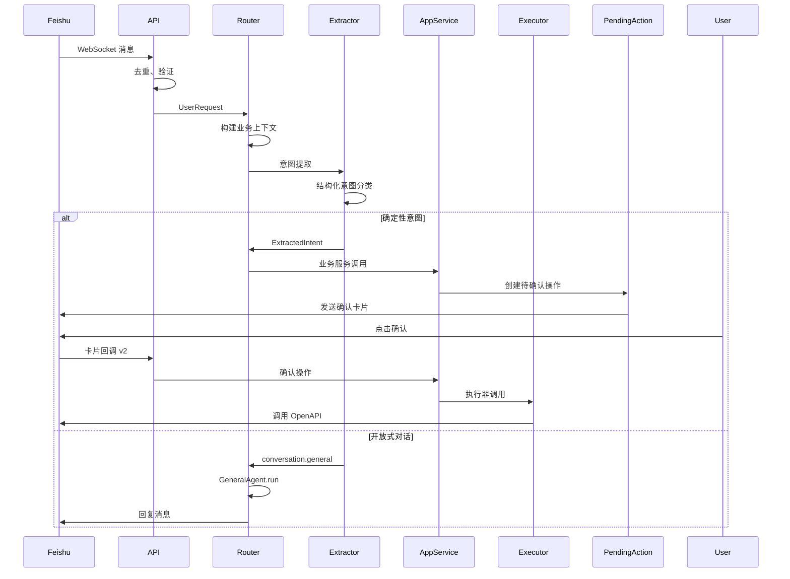

# Song Agent 2.1 架构文档

> 版本：2.1  
> 日期：2026-07-27  
> 状态：生产就绪

---

## 一、系统概述

Song Agent 2.1 是一个基于分层架构的飞书智能助手系统，采用确定性业务执行与开放式 Agent 相结合的设计。通过细粒度的超时控制、预算管理和安全策略，提供稳定可靠的企业级服务。

### 核心特性

- ✅ **分层架构**：API 层、应用层、领域层、基础设施层清晰分离
- ✅ **确定性路由**：日历、任务、提醒等业务走结构化意图提取，不进入 ReAct
- ✅ **ReAct 智能决策**：开放对话和复杂分析使用 LLM 自主选择工具
- ✅ **预算管理**：时间预算、请求预算、工具调用预算
- ✅ **安全隔离**：OAuth 2.0 多用户隔离，Token 加密存储
- ✅ **人工确认**：敏感操作需要用户确认后执行
- ✅ **可靠执行**：Pending Action 状态机 + Outbox 模式
- ✅ **分层上下文**：Request、Business、Conversation、Summary、Memory、Retrieved 六层
- ✅ **网络搜索**：集成 SearXNG、TalorData、You.com、Tavily 搜索引擎
- ✅ **可观测性**：完整的审计日志和追踪能力

---

## 二、架构设计

### 2.1 整体架构

```
┌─────────────────────────────────────────────────────────────┐
│                        飞书平台                               │
│  (WebSocket + Webhook + Interactive Card v2 + OAuth 2.0)    │
└────────────────────┬────────────────────────────────────────┘
                     │
                     ▼
┌─────────────────────────────────────────────────────────────┐
│                      API Layer                                │
│  api/chat.py: 消息入口、事件分发                              │
│  api/calendar.py / tasks.py / reminders.py: 业务路由         │
│  api/pending_actions.py: 卡片回调处理                         │
│  api/events.py: SSE 事件推送                                  │
└────────────────────┬────────────────────────────────────────┘
                     │
                     ▼
┌─────────────────────────────────────────────────────────────┐
│                  Application Layer                            │
│  request_router.py: 意图路由、确定性业务分发                  │
│  calendar_service.py: 日历应用服务                            │
│  task_service.py: 任务应用服务                                │
│  reminder_service.py: 提醒应用服务                            │
│  pending_action_service.py: 待确认操作服务                    │
│  result_renderer.py: 结果渲染                                 │
└────────────────────┬────────────────────────────────────────┘
                     │
         ┌───────────┴───────────┐
         │                       │
         ▼                       ▼
┌─────────────────┐     ┌─────────────────┐
│  Intelligence   │     │     Domain      │
│  intent_        │     │  intents.py     │
│  extractor.py   │     │  commands.py    │
│  general_       │     │  results.py     │
│  agent.py       │     │  policies.py    │
└────────┬────────┘     └────────┬────────┘
         │                       │
         └───────────┬───────────┘
                     │
                     ▼
┌─────────────────────────────────────────────────────────────┐
│                   ReAct Runtime                               │
│  agent/runtime.py: ReAct 循环、预算管理、决策引擎            │
│  agent/budget.py: 时间预算、请求预算、工具预算                │
│  agent/context_builder.py: 上下文裁剪、工具动态加载          │
│  agent/tool_registry.py: 工具注册、Schema 管理                │
│  policies/tool_policy.py: 工具权限、风险分级                  │
└────────────────────┬────────────────────────────────────────┘
                     │
                     ▼
┌─────────────────────────────────────────────────────────────┐
│                     Tool Layer                                │
│  feishu/openapi.py: 日历、文档 API（生产）                    │
│  feishu/mcp.py: MCP 工具（开发调试）                          │
│  search/mcp.py: 网络搜索 MCP（SearXNG/Tavily/You/TalorData） │
│  executors/: 日历/任务/提醒执行器                             │
└────────────────────┬────────────────────────────────────────┘
                     │
                     ▼
┌─────────────────────────────────────────────────────────────┐
│                   Service Layer                               │
│  services/pending_actions.py: 待确认操作状态机               │
│  services/outbox.py: Transactional Outbox 模式               │
│  services/encryption.py: Token 加密、密钥轮换                │
│  services/audit.py: 审计日志、敏感信息脱敏                   │
│  services/agent_runs.py: Agent 运行记录                      │
│  services/reconciliation.py: 远程状态恢复                    │
│  context/service.py: 会话上下文服务                          │
└────────────────────┬────────────────────────────────────────┘
                     │
                     ▼
┌─────────────────────────────────────────────────────────────┐
│                   Storage Layer                               │
│  store.py: SQLite WAL、多租户隔离、并发控制                  │
│  db/migrations.py: 数据库迁移、版本管理                       │
└─────────────────────────────────────────────────────────────┘
```

### 2.2 核心流程

#### 2.2.1 消息处理流程



#### 2.2.2 意图路由逻辑

```python
async def handle(self, request: UserRequest) -> ApplicationResult:
    # 1. 记录用户消息
    await self.conversation_contexts.record_user(request)
    
    # 2. 构建业务上下文
    business_context = await self.business_contexts.build_for_intent_extraction(request)
    
    # 3. 提取意图（结构化）
    extracted = await self.intent_extractor.extract(request, business_context)
    
    # 4. 置信度检查
    if extracted.confidence < self.minimum_confidence:
        return ApplicationResult(status="clarification_required", ...)
    
    # 5. 缺失字段检查
    if extracted.missing_fields:
        return ApplicationResult(status="clarification_required", ...)
    
    # 6. 确定性路由
    if extracted.intent == "calendar.create":
        return await self.calendar.prepare_create(request, extracted.arguments)
    elif extracted.intent == "reminder.batch_create":
        return await self.reminders.prepare_batch_create(request, extracted.arguments)
    # ... 其他确定性意图
    
    # 7. 开放式 Agent
    return await self.general_agent.run(enriched)
```

#### 2.2.3 ReAct 循环

```python
async def run(self, context: AgentContext) -> AgentResult:
    # 1. 创建预算
    budget = AgentRunBudget.create(self.settings)
    
    # 2. ReAct 循环
    while not finished and budget.remaining_seconds() > 0:
        # 2.1 检查预算
        budget.ensure_can_call_llm()
        
        # 2.2 构建上下文
        messages = self.context_builder.build_system_prompt(context)
        
        # 2.3 LLM 决策
        decision = await self.llm.decide(messages, timeout=step_timeout)
        
        # 2.4 处理决策
        if decision.is_final_answer():
            return AgentResult(status="success", ...)
        
        # 2.5 调用工具
        budget.ensure_can_call_tool()
        result = await self._call_tool(decision.tool_call, budget)
        
        # 2.6 记录历史
        history.append((decision, result))
```

---

## 三、核心模块详解

### 3.1 意图提取器 (`intelligence/intent_extractor.py`)

**职责**：一次性意图分类和字段提取

**核心功能**：
- 意图分类：识别 `calendar.create`、`task.query` 等确定性意图
- 字段提取：从自然语言中提取结构化参数
- 置信度评估：评估意图识别的确定性
- 缺失字段检测：识别必需但未提供的参数
- 批量提醒识别：识别编号列表形式的批量提醒请求

**支持的意图**：
```python
IntentName = Literal[
    # 日历
    "calendar.create", "calendar.query", "calendar.update", "calendar.delete",
    # 任务
    "task.create", "task.query", "task.update", "task.complete", "task.delete",
    # 提醒
    "reminder.create", "reminder.batch_create", "reminder.query", "reminder.cancel",
    # 待确认操作
    "pending_action.confirm", "pending_action.cancel", "pending_action.retry",
    # 用户
    "user.authorization.status", "user.preferences.get", "user.preferences.update",
    # 开放式
    "conversation.general", "content.summarize", "content.analyze",
    "recording.analyze", "workspace.explore", "multi_source.research",
]
```

### 3.2 请求路由器 (`application/request_router.py`)

**职责**：意图路由和业务服务协调

**核心功能**：
- 意图分发：根据意图类型分发到对应业务服务
- 置信度门禁：低于阈值的意图请求澄清
- 缺失字段处理：请求用户补充必需参数
- 上下文传递：构建并传递业务上下文
- 会话记录：记录用户和助手消息

**关键方法**：
```python
async def handle(request: UserRequest, direct_action: DirectPendingActionCommand | None) -> ApplicationResult
```

### 3.3 应用服务层

#### 3.3.1 日历应用服务 (`application/calendar_service.py`)

- `prepare_create`: 准备创建日程，返回确认卡片
- `query`: 查询日程
- `prepare_update`: 准备更新日程
- `prepare_delete`: 准备删除日程

#### 3.3.2 任务应用服务 (`application/task_service.py`)

- `prepare_create`: 准备创建任务
- `query`: 查询任务
- `prepare_update`: 准备更新任务
- `prepare_complete`: 准备完成任务
- `prepare_delete`: 准备删除任务

#### 3.3.3 提醒应用服务 (`application/reminder_service.py`)

- `prepare_create`: 准备创建单次提醒
- `prepare_batch_create`: 准备批量创建提醒（支持编号列表）
- `query`: 查询提醒
- `prepare_cancel`: 准备取消提醒

#### 3.3.4 待确认操作服务 (`application/pending_action_service.py`)

- `confirm`: 确认待执行操作
- `cancel`: 取消待执行操作
- `retry`: 重试失败操作

### 3.4 ReAct Runtime (`agent/runtime.py`)

**职责**：开放式对话的智能决策

**核心功能**：
- ReAct 循环：LLM 决策 → 工具调用 → 结果反馈 → 再次决策
- 预算管理：时间预算、LLM 请求数、工具调用数、步骤数
- 超时传播：deadline propagation，每一步都有独立超时
- 错误分类：连接错误、超时、速率限制、服务器错误
- 自动重试：指数退避，最多 1 次重试

**关键方法**：
```python
async def run(context: AgentContext) -> AgentResult
async def _run_with_budget(context, budget) -> AgentResult
async def _make_decision(context, budget) -> AgentDecision
async def _process_decision(decision, context, budget) -> ToolResult
```

### 3.5 预算管理 (`agent/budget.py`)

**职责**：防止无限循环和资源浪费

**核心功能**：
- 时间预算：总运行时间限制
- 请求预算：LLM 请求数限制
- 工具预算：工具调用数限制
- 步骤预算：ReAct 步骤数限制
- 预留时间：为最终回复预留时间

### 3.6 上下文管理 (`context/`)

#### 3.6.1 上下文模型 (`context/models.py`)

**六层上下文结构**：

```python
class RequestContext(BaseModel):
    """请求层：请求级元数据"""
    request_id: str
    tenant_key: str
    app_id: str
    principal_id: str
    channel: Literal["react", "feishu", "api"]
    chat_id: str
    thread_id: str
    timezone: str
    current_time: datetime

class BusinessContext(BaseModel):
    """业务层：业务相关上下文"""
    request: RequestContext
    recent_messages: list[ConversationMessage]
    conversation_summary: ConversationSummary | None
    memories: list[MemoryFact]
    active_pending_action: dict[str, Any] | None
    retrieved: dict[str, Any]
```

#### 3.6.2 上下文构建器 (`agent/context_builder.py`)

**职责**：实现 Prompt 和上下文裁剪，减少每次输入模型的数据

**裁剪配置**：
```python
@dataclass
class ContextConfig:
    max_history_messages: int = 10      # 最多 10 条历史消息
    max_tool_results: int = 5           # 最多 5 条工具结果
    max_document_chars: int = 2000      # 文档最大 2000 字符
    max_plan_chars: int = 500           # 计划最大 500 字符
    max_preference_chars: int = 300     # 偏好最大 300 字符
```

**核心方法**：

| 方法 | 功能 |
|------|------|
| `build_system_prompt()` | 构建系统提示词，包含状态摘要、当前时间、今日任务、工具 Schema、输出格式 |
| `build_user_message()` | 构建用户消息，包含历史对话、历史摘要、长期记忆、检索上下文 |
| `build_tool_result_summary()` | 构建工具结果摘要，最多保留 5 条 |

**裁剪策略**：

允许传入：
- 系统提示词（压缩版）
- 最近必要对话（最多 10 条，每条最多 200 字符）
- 当前任务摘要
- 必要用户偏好
- 当前步骤需要的工具 Schema
- 工具结果摘要（最多 5 条）

禁止默认传入：
- 完整历史会话
- 全部长期记忆
- 全部计划记录
- 全部工具 Schema
- 完整文档正文
- 所有历史工具结果

#### 3.6.3 上下文构建器 (`context/builders.py`)

- `BusinessContextBuilder`: 构建业务上下文
- `AgentRuntimeContextBuilder`: 构建 Agent 运行时上下文

#### 3.6.4 上下文服务 (`context/service.py`)

- 会话消息记录
- 长期记忆管理
- 会话摘要生成

### 3.7 工具注册 (`agent/tool_registry.py`)

**职责**：工具管理和动态加载

**注册的工具**：
- `plans.save_draft`: 保存今日计划草稿
- `reviews.save`: 保存复盘
- `documents.prepare_create`: 准备创建文档
- `documents.prepare_append`: 准备追加文档
- `websearch.search`: 网络搜索
- `tool_results.read`: 读取历史工具结果

### 3.8 飞书卡片回调 (`feishu/callbacks.py`)

**职责**：处理飞书 card.action.trigger v2 回调

**支持的操作**：
- `pending_action.confirm`: 确认操作
- `pending_action.cancel`: 取消操作

### 3.9 网络搜索 (`search/mcp.py`)

**职责**：通过 MCP 执行网络搜索

**支持的搜索引擎**：
- SearXNG: 自托管搜索引擎
- TalorData: AI 驱动搜索
- You.com: You 搜索
- Tavily: AI 搜索 API

**关键方法**：
```python
async def search(
    query: str,
    provider: str = "auto",
    max_results: int = 5,
    search_depth: str = "basic",
    include_answer: bool = False,
) -> list[SearchResult]
```

### 3.10 调度器 (`scheduler/runtime.py`)

**职责**：定时任务调度

**核心功能**：
- APScheduler 集成：使用 APScheduler 3.x
- Leader Lease：多实例部署时只有一个 Scheduler
- 任务持久化：scheduled_jobs 表作为唯一事实源
- 租约管理：scheduler_leases 表管理租约

---

## 四、数据模型

### 4.1 核心表结构

#### oauth_tokens
```sql
CREATE TABLE oauth_tokens (
    tenant_key TEXT NOT NULL,
    app_id TEXT NOT NULL,
    subject_id TEXT NOT NULL,
    access_token_ciphertext BLOB,
    access_token_nonce BLOB,
    refresh_token_ciphertext BLOB,
    refresh_token_nonce BLOB,
    encryption_key_version INTEGER,
    refresh_status TEXT DEFAULT 'idle',
    refresh_lease_owner TEXT,
    refresh_lease_expires_at INTEGER,
    token_version INTEGER DEFAULT 1,
    disabled_at INTEGER,
    PRIMARY KEY (tenant_key, app_id, subject_id)
);
```

#### pending_actions
```sql
CREATE TABLE pending_actions (
    action_id TEXT PRIMARY KEY,
    tenant_key TEXT NOT NULL,
    app_id TEXT NOT NULL,
    chat_id TEXT NOT NULL,
    thread_id TEXT NOT NULL DEFAULT '',
    creator_subject_id TEXT NOT NULL,
    creator_open_id TEXT NOT NULL,
    action_type TEXT NOT NULL,
    payload_json TEXT NOT NULL,
    payload_hash TEXT NOT NULL,
    payload_version INTEGER DEFAULT 1,
    idempotency_key TEXT DEFAULT '',
    source TEXT DEFAULT 'legacy_agent',
    status TEXT NOT NULL CHECK (status IN (
        'awaiting_confirmation', 'confirmed', 'executing', 'succeeded',
        'failed_retryable', 'failed_final', 'unknown_remote_state',
        'cancelled', 'expired'
    )),
    expires_at INTEGER NOT NULL,
    created_at INTEGER NOT NULL,
    updated_at INTEGER NOT NULL DEFAULT 0,
    claimed_by TEXT,
    claim_expires_at INTEGER,
    attempt_count INTEGER DEFAULT 0,
    remote_resource_id TEXT DEFAULT '',
    result_json TEXT DEFAULT '{}'
);
```

#### conversation_messages
```sql
CREATE TABLE conversation_messages (
    row_id TEXT PRIMARY KEY,
    session_id TEXT NOT NULL,
    tenant_key TEXT NOT NULL,
    app_id TEXT NOT NULL,
    principal_id TEXT NOT NULL,
    chat_id TEXT DEFAULT '',
    thread_id TEXT DEFAULT '',
    message_id TEXT NOT NULL,
    role TEXT NOT NULL CHECK (role IN ('user', 'assistant', 'tool', 'system')),
    content TEXT NOT NULL,
    created_at INTEGER NOT NULL,
    summarized_at INTEGER,
    UNIQUE (tenant_key, app_id, principal_id, message_id)
);
```

#### user_memories
```sql
CREATE TABLE user_memories (
    memory_id TEXT PRIMARY KEY,
    tenant_key TEXT NOT NULL,
    app_id TEXT NOT NULL,
    principal_id TEXT NOT NULL,
    memory_type TEXT NOT NULL,
    memory_key TEXT NOT NULL,
    memory_value TEXT NOT NULL,
    confidence REAL NOT NULL,
    source_message_id TEXT DEFAULT '',
    valid_from TEXT NOT NULL,
    valid_until TEXT DEFAULT '',
    created_at TEXT NOT NULL,
    updated_at TEXT NOT NULL,
    UNIQUE (tenant_key, app_id, principal_id, memory_type, memory_key)
);
```

#### tool_results
```sql
CREATE TABLE tool_results (
    result_ref TEXT PRIMARY KEY,
    tenant_key TEXT NOT NULL,
    app_id TEXT NOT NULL,
    principal_id TEXT NOT NULL,
    tool_name TEXT NOT NULL,
    summary TEXT NOT NULL,
    payload_json TEXT NOT NULL,
    truncated INTEGER DEFAULT 0,
    created_at INTEGER NOT NULL,
    expires_at INTEGER
);
```

#### agent_runs
```sql
CREATE TABLE agent_runs (
    run_id TEXT PRIMARY KEY,
    tenant_key TEXT NOT NULL,
    app_id TEXT NOT NULL,
    principal_id TEXT NOT NULL,
    conversation_key TEXT NOT NULL,
    inbound_message_id TEXT NOT NULL,
    model TEXT NOT NULL,
    status TEXT NOT NULL,
    step_count INTEGER DEFAULT 0,
    tool_call_count INTEGER DEFAULT 0,
    started_at INTEGER NOT NULL,
    completed_at INTEGER,
    final_response TEXT DEFAULT '',
    error_code TEXT DEFAULT ''
);
```

---

## 五、配置管理

### 5.1 核心配置项

#### LLM 超时配置
```bash
SONG_AGENT_LLM_CONNECT_TIMEOUT_SECONDS=10.0
SONG_AGENT_LLM_READ_TIMEOUT_SECONDS=75.0
SONG_AGENT_LLM_WRITE_TIMEOUT_SECONDS=15.0
SONG_AGENT_LLM_POOL_TIMEOUT_SECONDS=5.0
```

#### Agent 运行预算
```bash
SONG_AGENT_AGENT_RUN_TIMEOUT_SECONDS=150
SONG_AGENT_AGENT_MAX_LLM_REQUESTS=6
SONG_AGENT_AGENT_MAX_TOOL_CALLS=6
SONG_AGENT_AGENT_MAX_STEPS=8
SONG_AGENT_AGENT_FINISH_RESERVE_SECONDS=10
```

#### 上下文裁剪
```bash
SONG_AGENT_AGENT_MAX_PROMPT_TOKENS=8000
SONG_AGENT_AGENT_MAX_HISTORY_MESSAGES=10
SONG_AGENT_AGENT_MAX_TOOL_RESULT_LENGTH=2000
```

#### 搜索引擎配置
```bash
SONG_AGENT_SEARXNG_BASE_URL=https://searx.example.com
SONG_AGENT_TALORDATA_API_KEY=xxx
SONG_AGENT_YDC_API_KEY=xxx
SONG_AGENT_TAVILY_API_KEY=xxx
```

### 5.2 配置优先级

1. 环境变量（最高优先级）
2. `.env` 文件
3. 代码中的默认值（最低优先级）

---

## 六、安全设计

### 6.1 多租户隔离

- **Tenant Key**：租户标识
- **App ID**：应用标识
- **Principal ID**：用户标识
- **Conversation Key**：会话标识（tenant + app + thread + user）

### 6.2 Token 安全

- **加密存储**：使用 AES-256-GCM 加密
- **密钥轮换**：支持多版本密钥
- **不进入日志**：Token 彻底从日志中排除
- **不进入 AgentContext**：refresh_token 不传递给 Agent

### 6.3 工具权限

- **风险分级**：READ、LOW_WRITE、HIGH_WRITE、DESTRUCTIVE
- **确认策略**：高风险操作需要人工确认
- **OAuth 检查**：需要用户授权的工具检查 OAuth 状态

### 6.4 审计日志

- **敏感信息脱敏**：Token、Authorization header 等不记录
- **完整追踪**：所有操作都有审计记录
- **关联 ID**：支持跨服务追踪

---

## 七、部署架构

### 7.1 单机部署（当前）

```
┌─────────────────────────────────────┐
│         单台服务器                    │
│                                     │
│  ┌──────────────┐  ┌─────────────┐ │
│  │ Web Worker 1 │  │ Web Worker 2│ │
│  └──────────────┘  └─────────────┘ │
│                                     │
│  ┌──────────────────────────────┐  │
│  │  Feishu Gateway (单实例)      │  │
│  └──────────────────────────────┘  │
│                                     │
│  ┌──────────────────────────────┐  │
│  │  Scheduler (单 Leader)        │  │
│  └──────────────────────────────┘  │
│                                     │
│  ┌──────────────────────────────┐  │
│  │  SQLite WAL (本地磁盘)        │  │
│  └──────────────────────────────┘  │
└─────────────────────────────────────┘
```

**限制**：
- SQLite 文件不得放在 NFS 共享盘
- 单机部署，不支持跨地域
- 适中并发，不适合高写入吞吐

### 7.2 多机部署（未来）

```
┌─────────────────────────────────────┐
│         负载均衡器                   │
└──────────────┬──────────────────────┘
               │
       ┌───────┴───────┐
       │               │
┌──────▼──────┐  ┌─────▼──────┐
│ Web Worker 1│  │Web Worker 2│
└─────────────┘  └────────────┘
       │               │
       └───────┬───────┘
               │
┌──────────────▼──────────────┐
│  PostgreSQL (主从复制)       │
└─────────────────────────────┘
```

---

## 八、监控和可观测性

### 8.1 审计日志

- **操作类型**：agent.run、tool.call、oauth.authorize、pending_action.confirm
- **状态**：success、failure
- **元数据**：tenant_key、app_id、principal_id、chat_id、thread_id
- **敏感信息脱敏**：Token、Authorization header、文档内容

### 8.2 运行指标

- **Agent 运行时长**：P50、P95、P99
- **LLM 请求延迟**：连接、读取、总延迟
- **工具调用次数**：成功、失败、超时
- **预算超限次数**：时间、请求、工具

### 8.3 告警规则

- Agent 运行超时
- LLM 请求失败率 > 5%
- Token 解密失败
- Scheduler 租约丢失
- Pending Action 过期率 > 10%

---

## 九、测试覆盖

### 9.1 测试文件

- `test_agent_runtime.py`: Agent 运行时测试
- `test_audit.py`: 审计日志测试
- `test_calendar_application.py`: 日历应用服务测试
- `test_calendar_executor.py`: 日历执行器测试
- `test_card_callback_v2.py`: 卡片回调测试
- `test_context_memory.py`: 上下文记忆测试
- `test_encryption.py`: 加密测试
- `test_identity.py`: 身份验证测试
- `test_intent_extractor.py`: 意图提取测试
- `test_llm.py`: LLM 调用测试
- `test_oauth.py`: OAuth 测试
- `test_openapi.py`: OpenAPI 测试
- `test_outbox.py`: Outbox 测试
- `test_pending_actions.py`: 待确认操作测试
- `test_planner.py`: 计划器测试
- `test_scheduler_lease.py`: 调度器租约测试
- `test_search_integration.py`: 搜索集成测试
- `test_search_mcp.py`: 搜索 MCP 测试
- `test_store.py`: 存储测试
- `test_task_reminder_application.py`: 任务提醒应用测试
- `test_transport.py`: 传输层测试
- `test_workflow_messages.py`: 工作流消息测试

### 9.2 测试结果

```
======================== 101 passed, 2 warnings in 3.67s ========================
```

---

## 十、性能优化

### 10.1 LLM 调用优化

- **连接池**：复用 HTTP 连接
- **超时控制**：细粒度超时（连接、读取、写入）
- **自动重试**：指数退避，最多 1 次重试
- **错误分类**：连接错误、超时、速率限制、服务器错误

### 10.2 上下文裁剪

- **Token 限制**：最大 8000 tokens
- **历史裁剪**：最多 10 条历史消息
- **结果截断**：工具结果最多 2000 字符

### 10.3 数据库优化

- **WAL 模式**：提高并发性能
- **外键约束**：保证数据一致性
- **Busy Timeout**：避免锁等待超时
- **索引优化**：关键字段建立索引

---

## 十一、未来规划

### 11.1 短期（1-2 个月）

- 流式输出和飞书状态更新
- 更多飞书工具集成
- 任务增量修改优化

### 11.2 中期（3-6 个月）

- PostgreSQL 迁移
- 多机部署支持
- 更细粒度的权限控制
- 更丰富的工具生态

### 11.3 长期（6-12 个月）

- 多渠道支持（Slack、钉钉等）
- 插件系统
- 自定义工具开发
- 企业级功能（SSO、RBAC 等）

---

## 十二、目录结构

```
song_agent/
├── __init__.py
├── __main__.py              # 应用入口
├── app.py                   # FastAPI 应用
├── config.py                # 配置管理
├── llm.py                   # LLM 调用（OpenAI SDK + Tenacity）
├── models.py                # 数据模型
├── planner.py               # 计划相关工具
├── store.py                 # SQLite 存储
├── workflow.py              # 消息协调器
│
├── agent/                   # ReAct 智能体
│   ├── __init__.py
│   ├── budget.py            # 预算管理
│   ├── context.py           # Agent 上下文
│   ├── context_builder.py   # 上下文构建
│   ├── models.py            # Agent 模型
│   ├── runtime.py           # ReAct 运行时
│   └── tool_registry.py     # 工具注册
│
├── api/                     # API 层（新增）
│   ├── __init__.py
│   ├── calendar.py          # 日历路由
│   ├── chat.py              # 消息入口
│   ├── dependencies.py      # 依赖注入
│   ├── events.py            # SSE 事件
│   ├── pending_actions.py   # 待确认操作路由
│   ├── reminders.py         # 提醒路由
│   └── tasks.py             # 任务路由
│
├── application/             # 应用层（新增）
│   ├── __init__.py
│   ├── calendar_service.py  # 日历应用服务
│   ├── pending_action_service.py  # 待确认操作服务
│   ├── reminder_service.py  # 提醒应用服务
│   ├── request_router.py    # 请求路由器
│   ├── result_renderer.py   # 结果渲染
│   └── task_service.py      # 任务应用服务
│
├── cli/                     # 命令行工具
│   ├── __init__.py
│   └── rotate_keys.py       # 密钥轮换
│
├── context/                 # 上下文管理（新增）
│   ├── __init__.py
│   ├── builders.py          # 上下文构建器
│   ├── models.py            # 上下文模型
│   └── service.py           # 上下文服务
│
├── db/                      # 数据库
│   ├── __init__.py
│   └── migrations.py        # 数据库迁移
│
├── domain/                  # 领域层（新增）
│   ├── __init__.py
│   ├── commands.py          # 命令模型
│   ├── intents.py           # 意图定义
│   ├── policies.py          # 策略定义
│   └── results.py           # 结果模型
│
├── executors/               # 执行器（新增）
│   ├── __init__.py
│   ├── calendar_executor.py # 日历执行器
│   ├── calendar_mutation_executor.py
│   ├── reminder_executor.py # 提醒执行器
│   ├── registry.py          # 执行器注册
│   └── task_executor.py     # 任务执行器
│
├── feishu/                  # 飞书集成
│   ├── __init__.py
│   ├── callbacks.py         # 卡片回调 v2（新增）
│   ├── cards.py             # 交互卡片
│   ├── mcp.py               # MCP 工具（开发调试）
│   ├── oauth.py             # OAuth 2.0 授权
│   ├── openapi.py           # 飞书 OpenAPI（生产）
│   └── transport.py         # WebSocket Gateway
│
├── intelligence/            # 智能层（新增）
│   ├── __init__.py
│   ├── general_agent.py     # 通用 Agent
│   ├── intent_extractor.py  # 意图提取器
│   ├── structured_output.py # 结构化输出
│   └── time_parser.py       # 时间解析
│
├── observability/           # 可观测性
│   ├── __init__.py
│   ├── context.py           # 追踪上下文
│   └── redaction.py         # 敏感信息脱敏
│
├── policies/                # 策略
│   ├── __init__.py
│   └── tool_policy.py       # 工具权限策略
│
├── scheduler/               # 调度器
│   ├── __init__.py
│   ├── lease.py             # Leader 租约
│   └── runtime.py           # 调度器运行时
│
├── search/                  # 网络搜索（新增）
│   ├── __init__.py
│   └── mcp.py               # 搜索 MCP 客户端
│
└── services/                # 服务层
    ├── __init__.py
    ├── agent_runs.py        # Agent 运行记录
    ├── audit.py             # 审计日志
    ├── encryption.py        # Token 加密
    ├── outbox.py            # Transactional Outbox
    ├── pending_actions.py   # 待确认操作
    └── reconciliation.py    # 状态恢复
```

---

## 十三、关键设计决策

### 13.1 为什么分离确定性路由和 ReAct？

- **性能**：确定性业务不需要多轮推理，响应更快
- **可靠性**：结构化意图提取更稳定，不易受 LLM 波动影响
- **可预测性**：业务流程可预测，便于调试和审计
- **成本**：减少不必要的 LLM 调用

### 13.2 为什么选择 SQLite？

- **简单部署**：单文件数据库，无需额外服务
- **足够性能**：WAL 模式支持适中并发
- **可靠性**：ACID 事务，数据不易丢失
- **成本**：无需额外数据库服务器

### 13.3 为什么需要 Pending Action？

- **安全性**：敏感操作需要人工确认
- **可靠性**：状态机保证操作幂等执行
- **可追溯性**：所有操作都有审计记录
- **可恢复性**：支持远程状态恢复

### 13.4 为什么需要预算管理？

- **防止无限循环**：限制 Agent 运行时间和资源
- **成本控制**：限制 LLM 调用次数
- **用户体验**：避免长时间无响应
- **系统稳定性**：防止资源耗尽

### 13.5 为什么需要分层上下文？

- **Token 效率**：按需加载，避免 prompt 过长
- **关注点分离**：不同层服务不同目的
- **可扩展性**：易于添加新的上下文来源
- **可维护性**：清晰的上下文管理边界

---

## 十四、总结

Song Agent 2.1 是一个生产就绪的智能助手系统，通过以下设计保证稳定可靠：

1. **分层架构**：API、应用、领域、基础设施清晰分离
2. **确定性路由**：结构化意图提取 + 确定性执行路径
3. **ReAct 智能决策**：开放对话使用 LLM 自主选择工具
4. **预算管理**：防止无限循环和资源浪费
5. **安全隔离**：OAuth 2.0 多用户隔离，Token 加密存储
6. **可靠执行**：Pending Action 状态机 + Outbox 模式
7. **分层上下文**：六层上下文管理，Token 高效利用
8. **可观测性**：完整的审计日志和追踪能力

所有核心功能已实现并通过测试（101 passed），可以安全地部署到生产环境。