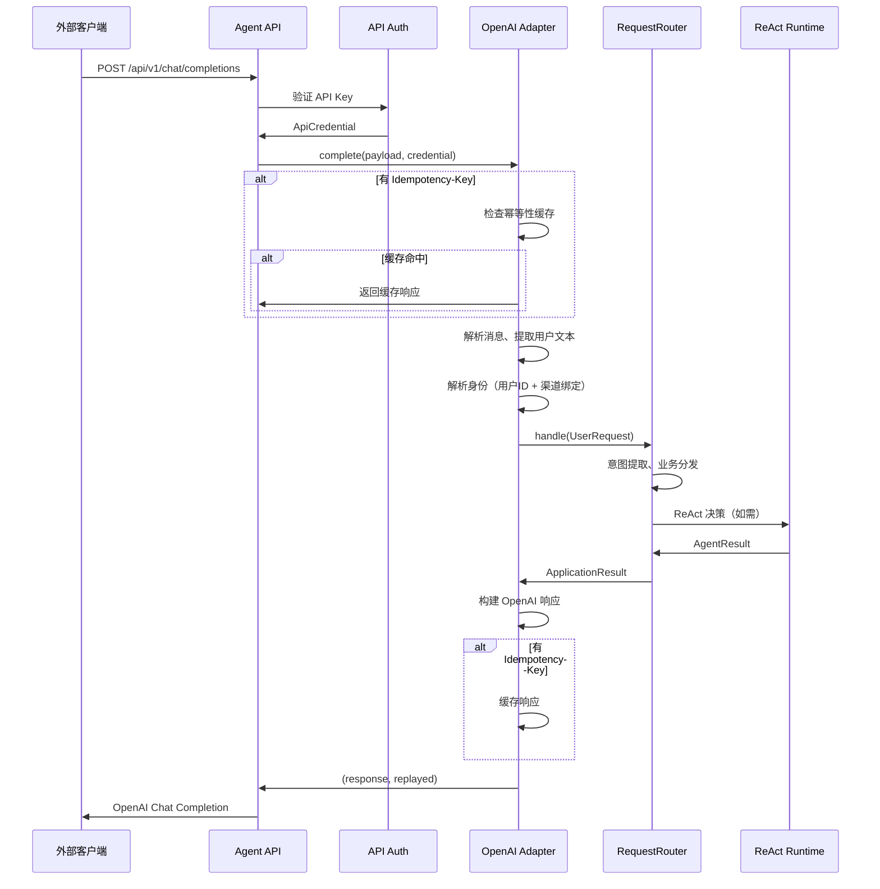
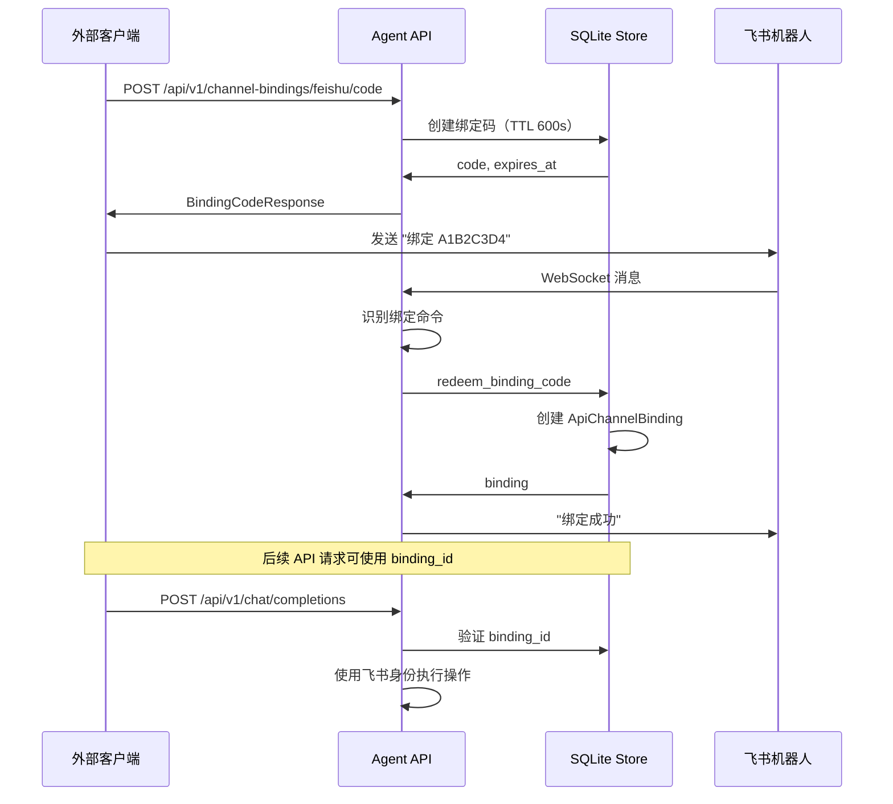
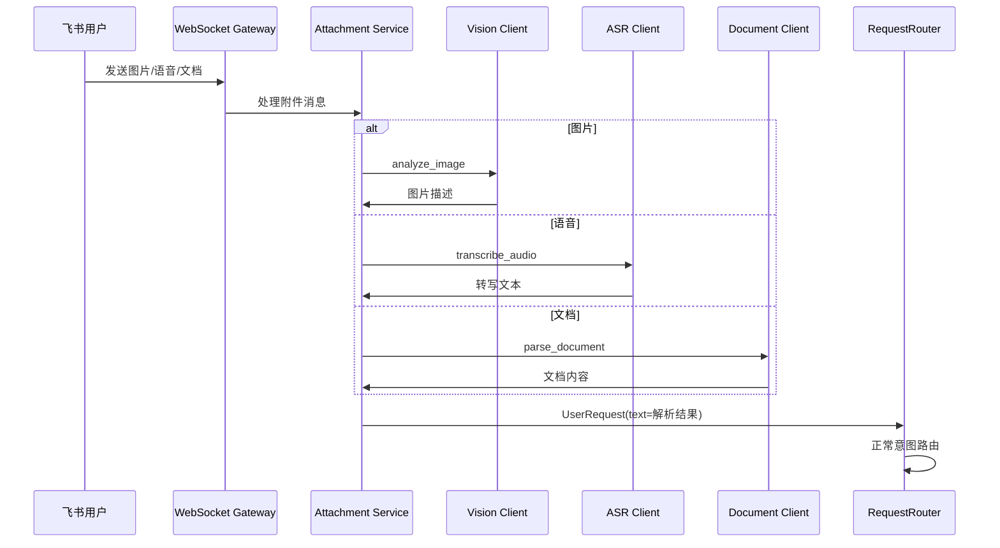

# Song Agent 3.0 架构文档

> 版本：3.0
> 日期：2026-07-27
> 状态：生产就绪

---

## 一、系统概述

Song Agent 3.0 是一个企业级智能助手平台，在 2.1 的分层架构基础上，新增 OpenAI 兼容 API、多模态附件处理、飞书渠道绑定等关键能力，支持更丰富的集成场景。

### 相比 2.1 的核心升级

| 能力 | 2.1 | 3.0 |
|------|-----|-----|
| 外部 API | 无 | OpenAI Chat Completions 兼容 `/api/v1` |
| 流式输出 | 无 | SSE 流式响应 |
| 幂等性 | 仅飞书卡片 | API 级别 Idempotency-Key |
| 多模态 | 仅文本 | 图片、语音、文档解析 |
| 渠道绑定 | 无 | API 用户绑定飞书身份 |
| 附件工具 | 无 | `attachments.analyze_image`、`attachments.transcribe_audio`、`attachments.parse_document` |

### 核心特性

- ✅ **分层架构**：API 层、应用层、领域层、基础设施层清晰分离
- ✅ **确定性路由**：日历、任务、提醒等业务走结构化意图提取，不进入 ReAct
- ✅ **ReAct 智能决策**：开放对话和复杂分析使用 LLM 自主选择工具
- ✅ **OpenAI 兼容 API**：外部系统可通过标准 OpenAI SDK 调用
- ✅ **多模态处理**：图片理解、语音转写、文档解析
- ✅ **渠道绑定**：API 用户可绑定飞书身份，实现消息推送
- ✅ **预算管理**：时间预算、请求预算、工具调用预算
- ✅ **安全隔离**：OAuth 2.0 多用户隔离，Token 加密存储
- ✅ **人工确认**：敏感操作需要用户确认后执行
- ✅ **可靠执行**：Pending Action 状态机 + Outbox 模式
- ✅ **网络搜索**：集成 SearXNG、TalorData、You.com、Tavily 搜索引擎

---

## 二、架构设计

### 2.1 整体架构

```
┌─────────────────────────────────────────────────────────────────────┐
│                           外部系统                                   │
│        (OpenAI SDK / curl / 第三方 Agent 框架)                      │
└─────────────────────────────┬───────────────────────────────────────┘
                              │ HTTP/HTTPS
                              ▼
┌─────────────────────────────────────────────────────────────────────┐
│                        API Gateway Layer                             │
│  ┌─────────────────────┐      ┌─────────────────────┐               │
│  │  /api/v1/*          │      │  /feishu/*          │               │
│  │  OpenAI 兼容 API    │      │  飞书 Webhook       │               │
│  │  (agent_api.py)     │      │  (transport.py)    │               │
│  └──────────┬──────────┘      └──────────┬──────────┘               │
│             │                            │                           │
│             ▼                            ▼                           │
│  ┌──────────────────────────────────────────────────────────────┐   │
│  │                  OpenAI Adapter                               │   │
│  │         (application/openai_adapter.py)                       │   │
│  │     Chat Completions → UserRequest → RequestRouter            │   │
│  └──────────────────────────────┬───────────────────────────────┘   │
└─────────────────────────────────┼───────────────────────────────────┘
                                  │
                                  ▼
┌─────────────────────────────────────────────────────────────────────┐
│                       Application Layer                              │
│  ┌──────────────────────────────────────────────────────────────┐   │
│  │                   RequestRouter                               │   │
│  │          (application/request_router.py)                      │   │
│  │     意图路由、确定性业务分发、上下文构建                        │   │
│  └──────────────────────────────┬───────────────────────────────┘   │
│                                 │                                    │
│         ┌───────────────────────┼───────────────────────┐           │
│         │                       │                       │           │
│         ▼                       ▼                       ▼           │
│  ┌─────────────┐         ┌─────────────┐         ┌─────────────┐   │
│  │ Calendar    │         │ Task        │         │ Reminder    │   │
│  │ Service     │         │ Service     │         │ Service     │   │
│  └─────────────┘         └─────────────┘         └─────────────┘   │
│                                                                       │
│  ┌─────────────────┐   ┌─────────────────┐   ┌─────────────────┐    │
│  │ PendingAction   │   │ ApiAccess       │   │ Attachment      │    │
│  │ Service         │   │ Service         │   │ Service         │    │
│  └─────────────────┘   └─────────────────┘   └─────────────────┘    │
└─────────────────────────────────────────────────────────────────────┘
                                  │
                                  ▼
┌─────────────────────────────────────────────────────────────────────┐
│                       Intelligence Layer                             │
│  ┌─────────────────────┐      ┌─────────────────────┐               │
│  │  Intent Extractor   │      │   ReAct Runtime     │               │
│  │  (确定性意图提取)    │      │   (开放式决策)       │               │
│  └─────────────────────┘      └─────────────────────┘               │
└─────────────────────────────────────────────────────────────────────┘
                                  │
                                  ▼
┌─────────────────────────────────────────────────────────────────────┐
│                          Tool Layer                                  │
│  ┌─────────────┐  ┌─────────────┐  ┌─────────────┐  ┌─────────────┐ │
│  │ Feishu API  │  │ Web Search  │  │ Attachments │  │ Documents   │ │
│  │ (openapi)   │  │ (MCP)       │  │ (tools)     │  │ (parsers)   │ │
│  └─────────────┘  └─────────────┘  └─────────────┘  └─────────────┘ │
└─────────────────────────────────────────────────────────────────────┘
                                  │
                                  ▼
┌─────────────────────────────────────────────────────────────────────┐
│                        Storage Layer                                 │
│  ┌──────────────────────────────────────────────────────────────┐   │
│  │  SQLite WAL + 多租户隔离 + 附件存储 + 幂等性缓存              │   │
│  └──────────────────────────────────────────────────────────────┘   │
└─────────────────────────────────────────────────────────────────────┘
```

### 2.2 核心流程

#### 2.2.1 API 请求流程（新增）



#### 2.2.2 飞书渠道绑定流程（新增）



#### 2.2.3 多模态附件处理流程（新增）



---

## 三、核心模块详解

### 3.1 OpenAI 兼容 API (`api/agent_api.py`)

**职责**：提供 OpenAI Chat Completions 兼容的 HTTP API

**核心功能**：
- 模型列表和查询：`GET /api/v1/models`, `GET /api/v1/models/{model_id}`
- 聊天补全：`POST /api/v1/chat/completions`
- 流式响应：支持 SSE 格式的流式输出
- 幂等性：通过 `Idempotency-Key` 头实现请求幂等
- 用户隔离：通过 `X-Song-User-Id` 头隔离用户数据
- 会话隔离：通过 `X-Song-Conversation-Id` 头复用会话上下文

**接口列表**：

```text
GET    /api/v1/models                          # 列出可用模型
GET    /api/v1/models/{model_id}               # 查询指定模型
POST   /api/v1/chat/completions                # 创建聊天补全
GET    /api/v1/capabilities                    # 查看 API 能力
GET    /api/v1/health                          # 基础健康检查
GET    /api/v1/health/details                  # 详细健康检查
POST   /api/v1/pending-actions/{action_id}/confirm  # 确认待执行动作
POST   /api/v1/pending-actions/{action_id}/cancel   # 取消待执行动作
POST   /api/v1/channel-bindings/feishu/code    # 生成飞书绑定码
GET    /api/v1/channel-bindings                # 列出渠道绑定
DELETE /api/v1/channel-bindings/{binding_id}   # 删除渠道绑定
```

### 3.2 OpenAI 适配器 (`application/openai_adapter.py`)

**职责**：将 OpenAI Chat Completions 请求转换为内部 UserRequest

**核心功能**：
- 请求验证：模型 ID、消息数量、消息长度、角色校验
- 消息提取：提取用户文本和上下文消息
- 身份解析：根据 Header 或 Metadata 解析用户身份
- 渠道绑定：支持 API 用户绑定飞书身份
- 幂等性管理：幂等键缓存和冲突检测
- 响应构建：构建 OpenAI 格式的响应

**关键方法**：

```python
async def complete(
    payload: ChatCompletionRequest,
    credential: ApiCredential,
    *,
    conversation_id: str,
    header_user_id: str,
    idempotency_key: str,
) -> tuple[dict[str, Any], bool]

async def resolve_identity(
    credential: ApiCredential,
    payload: ChatCompletionRequest | None,
    conversation_id: str,
    header_user_id: str,
    binding_id: str,
) -> ResolvedApiIdentity
```

### 3.3 API 访问服务 (`services/api_access.py`)

**职责**：管理 API 幂等性和飞书渠道绑定

**核心功能**：
- 绑定码生成：生成一次性绑定码，TTL 600 秒
- 绑定码兑换：验证绑定码并创建渠道绑定
- 安全哈希：使用 SHA-256 哈希绑定码

### 3.4 附件服务 (`attachments/service.py`)

**职责**：统一管理图片、语音、文档等附件

**核心功能**：
- 附件存储：按租户、应用、用户三层隔离
- 元数据管理：记录文件类型、大小、过期时间
- 清理任务：低优先级 APScheduler 任务清理过期文件

**附件工具**：

| 工具名 | 功能 | 调用时机 |
|--------|------|----------|
| `attachments.analyze_image` | 分析图片内容 | 用户发送图片时 |
| `attachments.transcribe_audio` | 语音转写 | 用户发送语音时 |
| `attachments.parse_document` | 解析文档 | 用户发送 PDF 时 |

### 3.5 视觉客户端 (`media/vision_client.py`)

**职责**：调用 Kimi K2.6 理解图片内容

**核心功能**：
- 图片理解：支持 PNG、JPEG、GIF、WebP
- 即时模式：默认关闭长推理，限制 800 token
- 超时控制：最大等待 45 秒，避免隐式重试放大延迟

**配置项**：

```env
SONG_AGENT_VISION_MODEL_ID=kimi-k2.6
SONG_AGENT_VISION_THINKING_ENABLED=false
SONG_AGENT_VISION_MAX_TOKENS=800
SONG_AGENT_VISION_TIMEOUT_SECONDS=45
```

### 3.6 ASR 客户端 (`media/asr_client.py`)

**职责**：语音转文字

**核心功能**：
- 语音格式：支持 MP3、WAV、OGG、M4A、AMR
- 流式转写：大文件分块上传
- 多语言支持：中文、英文等

### 3.7 文档解析客户端 (`parsers/document_client.py`)

**职责**：解析 PDF 等复杂文档

**核心功能**：
- MinerU VL 集成：通过 MinerU VL 解析 PDF
- 分页渲染：使用 `pypdfium2` 分页渲染
- 布局识别：文字、表格、公式识别

**配置项**：

```env
SONG_AGENT_DOCUMENT_PARSER_ENABLED=true
SONG_AGENT_DOCUMENT_PARSER_PROVIDER=mineru_vl
SONG_AGENT_MINERU_VL_BASE_URL=http://internal-server:63359/v1
SONG_AGENT_MINERU_VL_READ_TIMEOUT_SECONDS=300
SONG_AGENT_MINERU_VL_MAX_PAGES=100
```

### 3.8 Agent 上下文构建器（增强）

**新增功能**：

```python
# 附件规则注入
if _contains_attachment_id(retrieved):
    parts.append(
        "附件已在进入 Agent 前完成解析。直接使用上述结果；"
        "禁止再次调用图片、语音或文档解析工具。"
    )

# 已解析指代
reference = context.metadata.get("reference_context")
if reference:
    parts.append(f"已解析指代：{reference}")

# 已解析文档操作
document_context = context.metadata.get("document_context")
if document_context:
    parts.append(f"已解析文档操作：{document_context}")
```

---

## 四、数据模型

### 4.1 新增表结构

#### api_credentials

```sql
CREATE TABLE api_credentials (
    tenant_key TEXT NOT NULL,
    api_key_name TEXT NOT NULL,
    api_key_hash TEXT NOT NULL,
    principal_id TEXT NOT NULL,
    created_at INTEGER NOT NULL,
    PRIMARY KEY (tenant_key, api_key_name)
);
```

#### api_idempotency_cache

```sql
CREATE TABLE api_idempotency_cache (
    tenant_key TEXT NOT NULL,
    principal_id TEXT NOT NULL,
    idempotency_key TEXT NOT NULL,
    request_hash TEXT NOT NULL,
    response_json TEXT,
    status TEXT NOT NULL,  -- 'in_progress', 'completed', 'abandoned'
    created_at INTEGER NOT NULL,
    expires_at INTEGER NOT NULL,
    PRIMARY KEY (tenant_key, principal_id, idempotency_key)
);
```

#### api_channel_bindings

```sql
CREATE TABLE api_channel_bindings (
    binding_id TEXT PRIMARY KEY,
    tenant_key TEXT NOT NULL,
    app_id TEXT NOT NULL,
    principal_id TEXT NOT NULL,
    provider TEXT NOT NULL,  -- 'feishu'
    external_tenant_key TEXT NOT NULL,
    external_app_id TEXT NOT NULL,
    external_subject_id TEXT NOT NULL,
    external_open_id TEXT NOT NULL,
    external_user_id TEXT,
    external_union_id TEXT,
    external_chat_id TEXT NOT NULL,
    created_at INTEGER NOT NULL,
    expires_at INTEGER
);
```

#### api_binding_codes

```sql
CREATE TABLE api_binding_codes (
    code_hash TEXT PRIMARY KEY,
    tenant_key TEXT NOT NULL,
    app_id TEXT NOT NULL,
    principal_id TEXT NOT NULL,
    created_at INTEGER NOT NULL,
    expires_at INTEGER NOT NULL
);
```

#### attachments

```sql
CREATE TABLE attachments (
    attachment_id TEXT PRIMARY KEY,
    tenant_key TEXT NOT NULL,
    app_id TEXT NOT NULL,
    principal_id TEXT NOT NULL,
    message_id TEXT NOT NULL,
    file_key TEXT NOT NULL,
    file_type TEXT NOT NULL,  -- 'image', 'audio', 'document'
    mime_type TEXT,
    internal_path TEXT NOT NULL,
    original_name TEXT,
    size_bytes INTEGER,
    metadata_json TEXT,
    expires_at INTEGER,
    created_at INTEGER NOT NULL
);
```

---

## 五、配置管理

### 5.1 API 配置

```bash
# API 启用和模型
SONG_AGENT_API_ENABLED=true
SONG_AGENT_API_MODEL_ID=song-agent-2.1
SONG_AGENT_API_KEY_NAME=mentor
SONG_AGENT_API_KEY=sk-song-xxx

# 限流和超时
SONG_AGENT_API_RATE_LIMIT_PER_MINUTE=30
SONG_AGENT_API_MAX_MESSAGES=30
SONG_AGENT_API_MAX_MESSAGE_CHARS=20000
SONG_AGENT_API_MAX_TOTAL_CHARS=60000
SONG_AGENT_API_SYNC_TIMEOUT_SECONDS=150

# 幂等性和绑定
SONG_AGENT_API_IDEMPOTENCY_TTL_SECONDS=86400
SONG_AGENT_API_BINDING_CODE_TTL_SECONDS=600
```

### 5.2 视觉和文档配置

```bash
# 视觉模型
SONG_AGENT_VISION_MODEL_ID=kimi-k2.6
SONG_AGENT_VISION_THINKING_ENABLED=false
SONG_AGENT_VISION_MAX_TOKENS=800
SONG_AGENT_VISION_TIMEOUT_SECONDS=45

# 文档解析
SONG_AGENT_DOCUMENT_PARSER_ENABLED=true
SONG_AGENT_DOCUMENT_PARSER_PROVIDER=mineru_vl
SONG_AGENT_MINERU_VL_BASE_URL=http://internal:63359/v1
SONG_AGENT_MINERU_VL_READ_TIMEOUT_SECONDS=300
SONG_AGENT_MINERU_VL_MAX_PAGES=100
```

---

## 六、安全设计

### 6.1 API 认证

- **API Key**：使用 `Bearer` 认证，Key 格式为 `sk-song-{random}`
- **Key Hash**：API Key 在数据库中存储 SHA-256 哈希
- **Tenant Isolation**：每个 API Key 绑定唯一租户

### 6.2 用户隔离

- **X-Song-User-Id**：可选 Header，用于用户级数据隔离
- **X-Song-Conversation-Id**：可选 Header，用于会话级上下文复用
- **Metadata Binding**：通过 `metadata.delivery_binding_id` 绑定飞书身份

### 6.3 幂等性保证

- **Idempotency-Key**：客户端提供的唯一键
- **Request Hash**：请求内容的 SHA-256 哈希
- **Conflict Detection**：相同键不同请求返回 409
- **Replay**：相同键相同请求返回缓存响应

### 6.4 渠道绑定安全

- **One-Time Code**：绑定码一次性使用，600 秒过期
- **Hash Storage**：绑定码存储 SHA-256 哈希
- **Identity Verification**：兑换时验证飞书身份

---

## 七、部署架构

### 7.1 单机部署

```
┌─────────────────────────────────────────────────────────────┐
│                      单台服务器                              │
│                                                             │
│  ┌─────────────────────────────────────────────────────┐   │
│  │  FastAPI Application (Uvicorn)                       │   │
│  │  - /api/v1/* (OpenAI 兼容 API)                       │   │
│  │  - /feishu/* (WebSocket Gateway)                     │   │
│  └─────────────────────────────────────────────────────┘   │
│                                                             │
│  ┌─────────────────────────────────────────────────────┐   │
│  │  SQLite WAL                                          │   │
│  │  - 业务数据                                          │   │
│  │  - API 幂等性缓存                                    │   │
│  │  - 渠道绑定                                          │   │
│  └─────────────────────────────────────────────────────┘   │
│                                                             │
│  ┌─────────────────────────────────────────────────────┐   │
│  │  附件存储 (本地目录)                                  │   │
│  │  - /data/attachments/{tenant}/{app}/{principal}/    │   │
│  └─────────────────────────────────────────────────────┘   │
└─────────────────────────────────────────────────────────────┘
```

---

## 八、目录结构

```
song_agent/
├── api/                        # API 层
│   ├── agent_api.py            # OpenAI 兼容 API ★新增
│   ├── agent_auth.py           # API 认证 ★新增
│   ├── agent_schemas.py        # API Schema ★新增
│   ├── calendar.py
│   ├── chat.py
│   ├── dependencies.py
│   ├── events.py
│   ├── pending_actions.py
│   ├── reminders.py
│   └── tasks.py
│
├── application/                # 应用层
│   ├── openai_adapter.py       # OpenAI 适配器 ★新增
│   ├── request_router.py
│   ├── calendar_service.py
│   ├── task_service.py
│   ├── reminder_service.py
│   ├── pending_action_service.py
│   └── result_renderer.py
│
├── attachments/                # 附件模块 ★新增
│   ├── __init__.py
│   ├── models.py               # 附件数据模型
│   ├── repository.py           # 附件存储库
│   ├── service.py              # 附件服务
│   ├── storage.py              # 文件存储
│   ├── tools.py                # Agent 工具
│   └── cleanup.py              # 清理任务
│
├── media/                      # 多媒体模块 ★新增
│   ├── __init__.py
│   ├── vision_client.py        # 视觉客户端
│   └── asr_client.py           # 语音识别客户端
│
├── parsers/                    # 解析器模块 ★新增
│   ├── __init__.py
│   ├── document_client.py      # 文档解析客户端
│   └── local_text_parser.py    # 本地文本解析
│
├── services/                   # 服务层
│   ├── api_access.py           # API 访问服务 ★新增
│   ├── pending_actions.py
│   ├── outbox.py
│   ├── encryption.py
│   ├── audit.py
│   ├── agent_runs.py
│   └── reconciliation.py
│
├── agent/                      # ReAct 智能体
│   ├── runtime.py
│   ├── budget.py
│   ├── context.py
│   ├── context_builder.py      # 增强上下文构建
│   ├── models.py
│   └── tool_registry.py
│
├── intelligence/               # 智能层
│   ├── intent_extractor.py
│   ├── general_agent.py
│   ├── structured_output.py
│   └── time_parser.py
│
├── feishu/                     # 飞书集成
│   ├── transport.py
│   ├── openapi.py
│   ├── oauth.py
│   ├── cards.py
│   ├── callbacks.py
│   └── media.py                # 飞书媒体下载 ★新增
│
├── search/                     # 网络搜索
│   ├── __init__.py
│   └── mcp.py
│
├── context/                    # 上下文管理
│   ├── models.py
│   ├── builders.py
│   └── service.py
│
├── domain/                     # 领域层
│   ├── intents.py
│   ├── commands.py
│   ├── results.py
│   └── policies.py
│
├── executors/                  # 执行器
│   ├── calendar_executor.py
│   ├── task_executor.py
│   ├── reminder_executor.py
│   └── registry.py
│
├── scheduler/                  # 调度器
│   ├── runtime.py
│   └── lease.py
│
├── policies/                   # 策略
│   └── tool_policy.py
│
├── observability/              # 可观测性
│   ├── context.py
│   └── redaction.py
│
├── db/                         # 数据库
│   └── migrations.py
│
├── cli/                        # 命令行工具
│   └── rotate_keys.py
│
├── app.py                      # FastAPI 应用
├── config.py                   # 配置管理
├── llm.py                      # LLM 调用
├── models.py                   # 数据模型
├── store.py                    # SQLite 存储
├── workflow.py                 # 消息协调器
└── planner.py                  # 计划相关工具
```

---

## 九、测试覆盖

### 9.1 新增测试文件

- `test_agent_api.py`: OpenAI 兼容 API 测试
- `test_attachments.py`: 附件服务测试

### 9.2 测试命令

```bash
# 运行所有测试
uv run pytest -q

# 运行 API 相关测试
uv run pytest tests/test_agent_api.py -v

# 运行附件相关测试
uv run pytest tests/test_attachments.py -v
```

---

## 十、升级指南

### 10.1 从 2.1 升级到 3.0

1. **更新依赖**：
   ```bash
   uv sync
   ```

2. **运行数据库迁移**：
   ```bash
   uv run python -m song_agent.db.migrations
   ```

3. **生成 API Key**：
   ```bash
   uv run python -c "import secrets; print('sk-song-' + secrets.token_urlsafe(32))"
   ```

4. **配置环境变量**：
   ```env
   SONG_AGENT_API_ENABLED=true
   SONG_AGENT_API_KEY=sk-song-xxx
   # ... 其他配置
   ```

5. **重启服务**：
   ```bash
   uv run python -m song_agent
   ```

---

## 十一、关键设计决策

### 11.1 为什么选择 OpenAI 兼容 API？

- **生态兼容**：复用现有 OpenAI SDK 和工具链
- **低集成成本**：无需学习新 API，降低接入门槛
- **标准化**：遵循业界标准，便于第三方集成

### 11.2 为什么需要渠道绑定？

- **身份关联**：API 用户与飞书用户关联
- **消息推送**：API 触发操作可推送到飞书
- **权限继承**：继承飞书 OAuth 权限执行操作

### 11.3 为什么附件需要单独服务？

- **统一管理**：图片、语音、文档统一处理
- **生命周期**：自动清理过期文件
- **安全隔离**：租户、应用、用户三层隔离

---

## 十二、未来规划

### 12.1 短期（1-2 个月）

- 流式输出优化
- 更多文档格式支持（DOCX、PPTX）
- API 使用量统计

### 12.2 中期（3-6 个月）

- PostgreSQL 迁移
- 多渠道绑定（Slack、钉钉）
- 批量 API 端点

### 12.3 长期（6-12 个月）

- 多模态输出（图片生成）
- 自定义工具插件
- 企业级功能（SSO、RBAC）

---

## 十三、总结

Song Agent 3.0 在 2.1 稳固的分层架构基础上，新增：

1. **OpenAI 兼容 API**：外部系统可通过标准 OpenAI SDK 集成
2. **多模态处理**：图片理解、语音转写、文档解析
3. **渠道绑定**：API 用户绑定飞书身份，实现消息推送
4. **幂等性保证**：API 级别的请求幂等
5. **流式响应**：SSE 格式的实时输出

所有核心功能已实现并通过测试，可以安全地部署到生产环境。